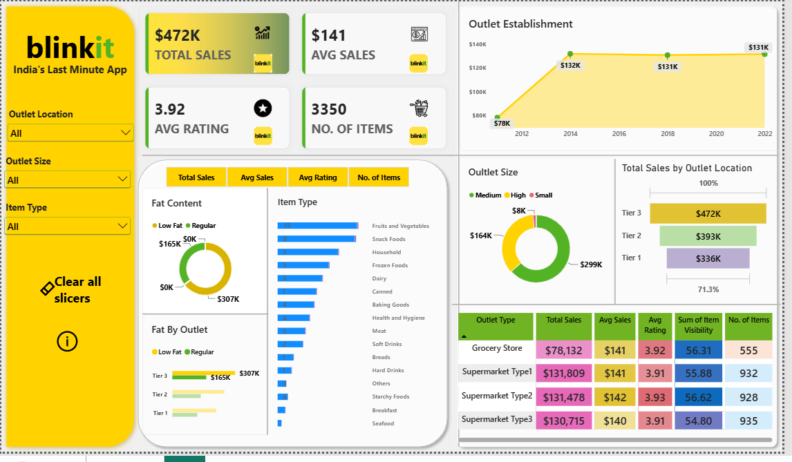
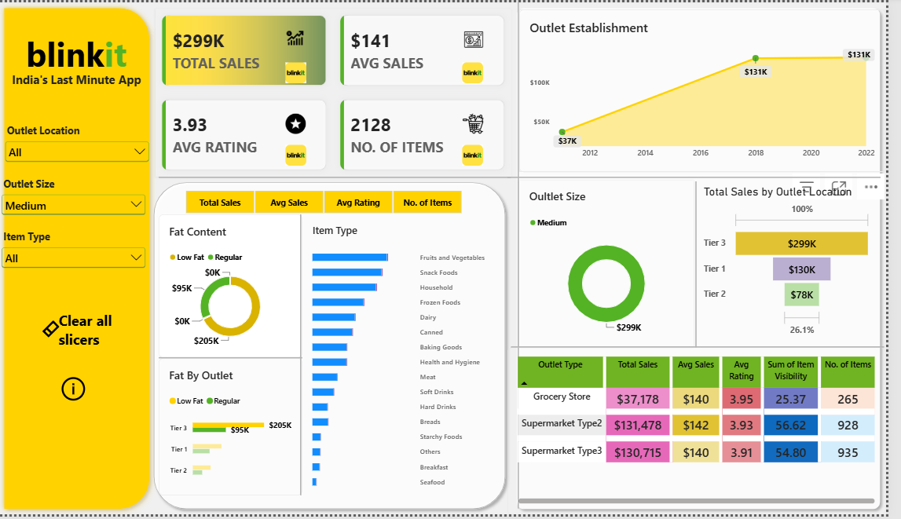
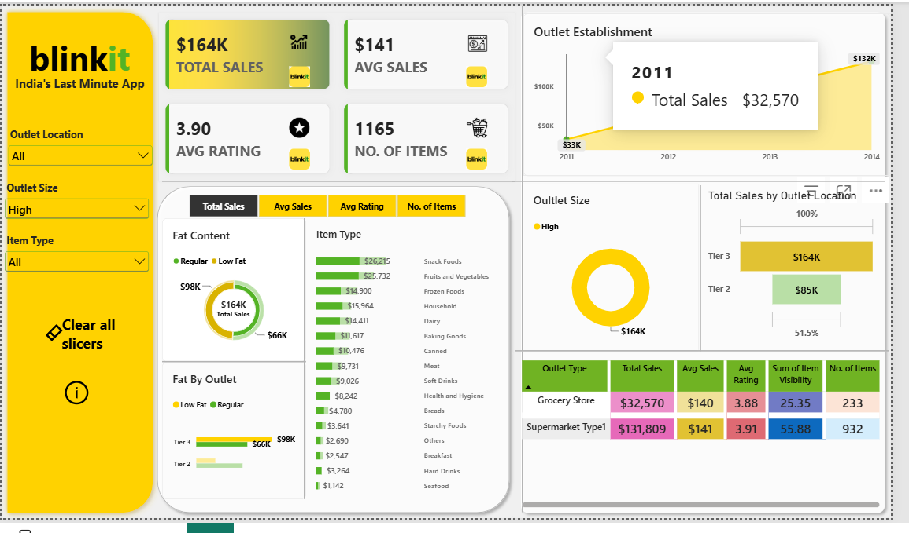

# 🟡 Blinkit Grocery Sales Dashboard (Power BI)

An interactive Power BI dashboard analysing sales performance, customer ratings and inventory distribution for Blinkit-style grocery outlets across outlet sizes, locations and types.



## 🎯 Objective
Build a one-page dashboard that answers: *Which items, outlet sizes, outlet types and locations drive sales and customer satisfaction, and where are the opportunities to optimise?*

## 📦 Dataset
| Item | Detail |
|---|---|
| File | `data/BlinkIT_Grocery_Data.xlsx` |
| Rows / Columns | 8,523 / 12 |
| Columns | Item Fat Content, Item Identifier, Item Type, Outlet Establishment Year, Outlet Identifier, Outlet Location Type, Outlet Size, Outlet Type, Item Visibility, Item Weight, Sales, Rating |

## 📊 KPIs
| KPI | Meaning |
|---|---|
| Total Sales | Overall revenue from all items sold |
| Average Sales | Average revenue per sale |
| Number of Items | Count of item records sold |
| Average Rating | Average customer rating |

## 📈 Charts
1. **Total Sales by Fat Content** – donut chart
2. **Total Sales by Item Type** – bar chart
3. **Fat Content by Outlet** – stacked column/bar chart
4. **Total Sales by Outlet Establishment Year** – line chart
5. **Sales by Outlet Size** – donut chart
6. **Sales by Outlet Location** – funnel chart
7. **All Metrics by Outlet Type** – matrix table
- **Slicers:** Outlet Location, Outlet Size, Item Type, plus a *Clear all slicers* button.
- **Metric toggle:** switch the Fat Content / Item Type / Fat-by-Outlet visuals between Total Sales, Avg Sales, Avg Rating and No. of Items.

## 🔄 Project Workflow
Requirement gathering → Data walkthrough → Data connection → Data cleaning / quality check → Data modelling → Data processing → DAX calculations → Dashboard layout → Chart development & formatting → Report development → Insights generation

## 🧹 Data Cleaning
`Item Fat Content` had 5 inconsistent labels (`Regular`, `Low Fat`, `low fat`, `LF`, `reg`). They were standardised into two: **Low Fat** and **Regular**.

## 🧮 DAX Measures (standard form)
```DAX
Total Sales  = SUM('BlinkIT Grocery Data'[Sales])
Avg Sales    = AVERAGE('BlinkIT Grocery Data'[Sales])
No. of Items = COUNT('BlinkIT Grocery Data'[Item Identifier])
Avg Rating   = AVERAGE('BlinkIT Grocery Data'[Rating])
```

## 🔍 Key Insights
Full write-up in [REPORT.md](REPORT.md). Highlights (full dataset):
- Total sales ≈ **$1.20M**, average sale ≈ **$141**, average rating ≈ **3.97**
- **Low Fat** items generate ~65% of sales
- **Fruits & Vegetables** and **Snack Foods** are the top item types
- **Medium** outlets lead by size; **Tier 3** locations lead by region
- **Supermarket Type1** contributes ~65% of sales
- Average sale value and rating are nearly identical across outlet types, so volume (not price or satisfaction) drives the differences

## 🖼️ More Screenshots
| Medium outlets filter | High outlets filter |
|---|---|
|  |  |

## 🛠️ Tools
Power BI Desktop · DAX · Excel · Power Query

## 📁 Repository Structure
```
├── README.md
├── REPORT.md
├── LINKEDIN_POST.md
├── dashboard/Blinkit_Dashboard.pbix
├── data/BlinkIT_Grocery_Data.xlsx
└── images/
```

## ▶️ How to Use
1. Download `dashboard/Blinkit_Dashboard.pbix`
2. Open it in Power BI Desktop
3. If prompted, point the data source to `data/BlinkIT_Grocery_Data.xlsx`
4. Use the slicers and metric tabs to explore

## 🙌 Credits
Dataset and business requirements based on the Blinkit analysis guided project by **Data Tutorials** (YouTube). Dashboard built and customised by me.

## 👤 Author
**Harsh** – B.Tech CSE student · [LinkedIn](https://www.linkedin.com/in/your-profile) · [GitHub](https://github.com/your-username)
